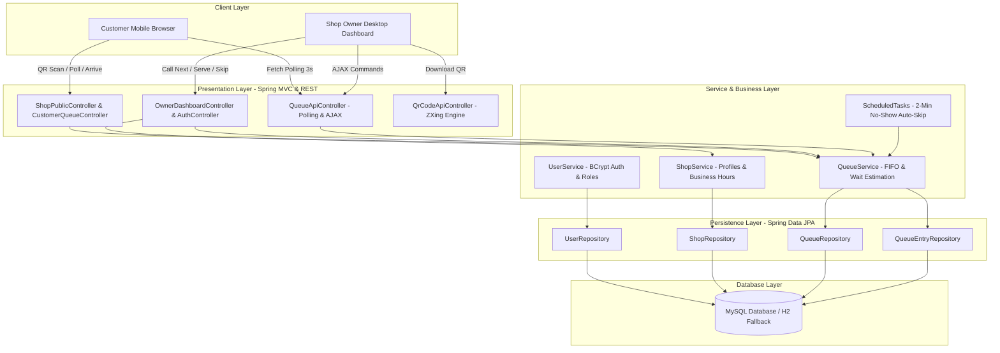
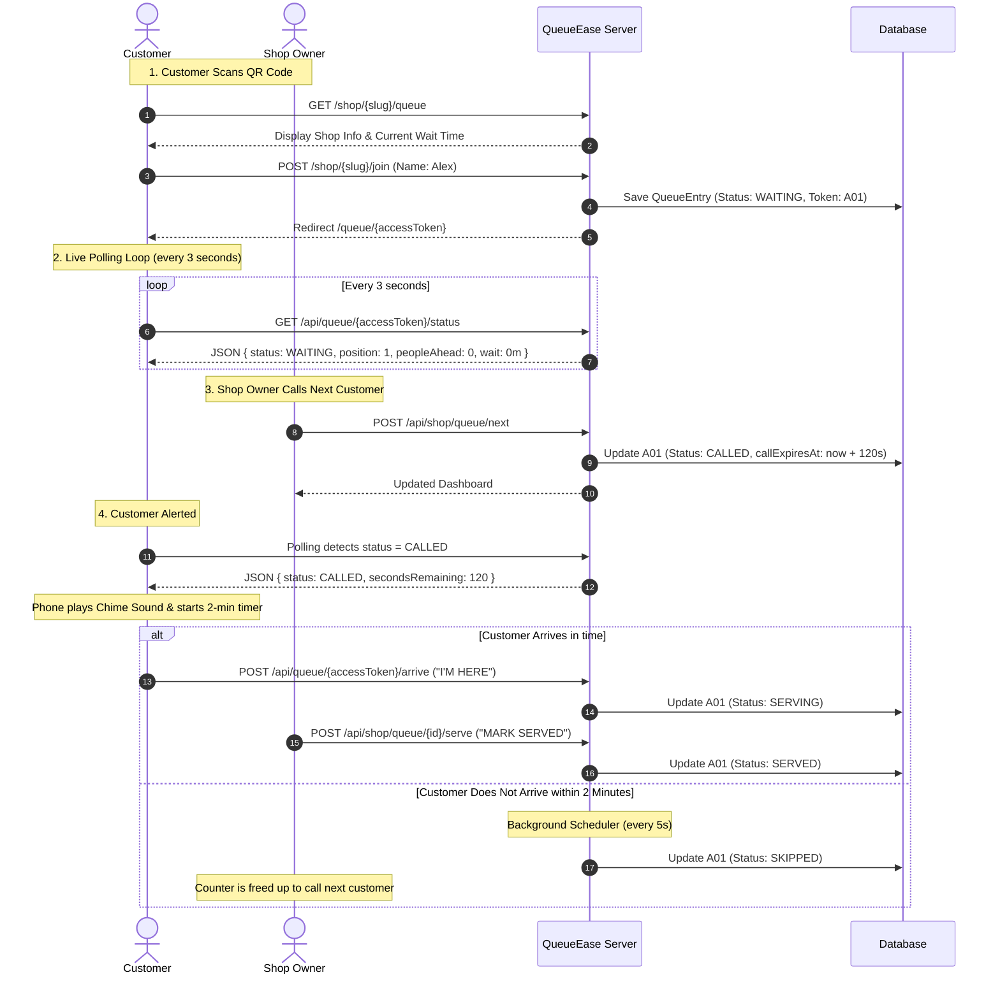
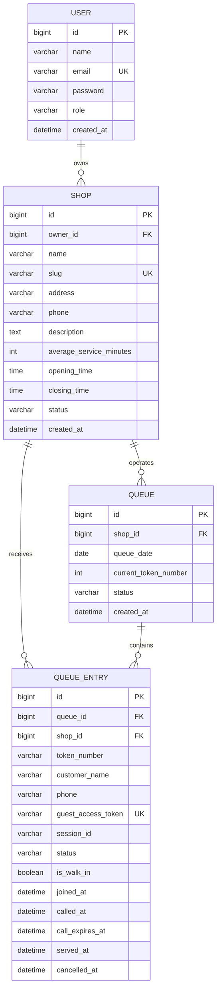

# QueueEase – Smart Digital Queue Management System

[](https://www.oracle.com/java/)
[](https://spring.io/projects/spring-boot)
[](https://www.mysql.com/)
[](https://getbootstrap.com/)
[](LICENSE)

> A modern, zero-app, QR-powered digital queue management system built for walk-in businesses (salons, clinics, repair centers, cafes, and service counters). Customers scan an entrance QR code to join the line and track their turn live on their phone; shop owners manage the counter in real time from a centralized dashboard.

---

## 1. Project Overview & Problem Statement

### The Real-World Problem
- **Customer Frustration**: Standing in physical lines wastes valuable time and limits personal freedom.
- **Lost Revenue**: Up to 30% of potential walk-in customers abandon a business upon seeing a crowded waiting area.
- **Operational Chaos**: Manual paper tokens and shouting customer names cause confusion, disputes over turn order, and no-shows.
- **Over-Engineered Apps Fail**: Forcing customers to download a mobile app from an App Store or register an account with passwords and SMS OTPs just to wait 15 minutes creates unbearable friction.

### The QueueEase Solution
QueueEase delivers a frictionless, web-native experience:
1. **Zero App Download & Zero Account Creation**: Customers simply scan a physical QR code posted at the shop entrance using their phone's native camera.
2. **Instant Browser Token**: The customer inputs their name and immediately receives a daily sequential token (e.g. `A01`, `A02`).
3. **Live Turn Tracking**: The customer dashboard updates every 3 seconds via background AJAX polling, displaying their position, people ahead, and estimated wait time. Customers can wander nearby, grab coffee, or wait comfortably in their car.
4. **2-Minute Arrival Window with Audio Chime**: When called by the shop owner, the customer’s phone sounds a pleasant chime, flashes a visual alert, and starts a 120-second countdown with an "I'M HERE" confirmation button.
5. **Auto-Skip for No-Shows**: A lightweight background Spring task automatically skips unresponsive customers after 2 minutes, preventing counter bottlenecks.

---

## 2. System Architecture

QueueEase is built as a clean Spring Boot monolith adhering to standard layered architecture:



---

## 3. Queue Lifecycle & Business Flow



---

## 4. Database Schema (ER Diagram)



---

## 5. Technology Stack & College Interview Rationale

| Layer | Technology | Why Chosen? (College Interview Answer) |
|---|---|---|
| **Language** | Java 17 LTS | Modern LTS Java featuring pattern matching, text blocks, and record-like immutability while maintaining rock-solid enterprise stability. |
| **Framework** | Spring Boot 3.3.4 | Industry-standard convention-over-configuration framework with built-in dependency injection, embedded Tomcat, and production metrics. |
| **Persistence** | Spring Data JPA + Hibernate | Eliminates boilerplate SQL using clean repository interfaces, object-relational mapping, and `@Transactional` concurrency safety. |
| **Database** | MySQL 8.0 / H2 | Relational integrity with unique indexes on tokens and slugs. Includes zero-setup in-memory H2 fallback for instant grading and evaluation. |
| **Security** | Spring Security 6 | Secures shop owner dashboard endpoints with `BCrypt` password hashing and role-based access (`ROLE_OWNER`), while keeping customer queue access guest-friendly via cryptographic UUIDs. |
| **Frontend** | Thymeleaf + Bootstrap 5.3 | Server-side rendering (SSR) ensures ultra-fast mobile loading on low-bandwidth networks, while Bootstrap 5 provides a mobile-first responsive layout. |
| **Real-Time** | Vanilla JS Polling (3–5s) | **Explainable Architecture**: WebSockets introduce stateful connection management, firewall disconnects, and thread memory overhead. Polling over standard HTTP REST is simple, stateless, reliable, and easily explainable in an interview. |
| **QR Engine** | ZXing (Zebra Crossing) | Embedded Java library that dynamically converts URLs into high-contrast PNG byte streams without third-party cloud API dependencies. |
| **Audio Alert** | HTML5 Web Audio API | Synthesizes an audible dual-tone notification chime in-browser without relying on external MP3 downloads or broken audio links. |

---

## 6. Key Business Formulas & Algorithms

### 1. Wait Time Estimation Formula
$$\text{Estimated Wait Time} = \text{People Ahead} \times \text{Average Service Duration}$$

- **People Ahead**: Calculated dynamically by querying the database for all customers in status `WAITING` who joined strictly before this customer in today's queue, plus 1 if another customer is currently `CALLED` or `SERVING`.
- **Explainability**: Simple, predictable, and transparent for customers. Can later be replaced by an ML service without modifying controllers or views.

### 2. Daily Token Reset
- Operating tokens are grouped by `shop_id` and `queue_date` (`LocalDate.now()`).
- Tokens follow the format: `A01`, `A02` ... `A99`, then `B01`.
- Yesterday’s records remain permanently available for shop history and throughput analytics.

### 3. Concurrency Protection
- Queue actions (such as `callNextCustomer()`) run inside `@Transactional` service methods.
- The service enforces that a shop owner cannot call a new customer while another customer is actively being served or has time remaining on their call timer.

---

## 7. Demo Credentials & Sample Data

The application automatically seeds 4 realistic shops with active queue entries upon first launch:

| Shop Name | Category | Demo Owner Email | Password | Shop Public URL |
|---|---|---|---|---|
| **Classic Cuts Salon** | Salon & Grooming | `salon@queueease.com` | `password123` | `/shop/classic-cuts/queue` |
| **QuickFix Mobile Repair**| Tech Repair | `repair@queueease.com` | `password123` | `/shop/quickfix/queue` |
| **CarePoint Clinic** | Healthcare | `clinic@queueease.com` | `password123` | `/shop/carepoint/queue` |
| **FreshBite Restaurant** | Dining / Tables | `freshbite@queueease.com` | `password123` | `/shop/freshbite/queue` |

---

## 8. Step-by-Step Multi-Browser Demo Script

Follow this script to demonstrate the complete real-time workflow in a college presentation or interview:

### Setup
1. **Window 1 (Owner Dashboard)**: Open Chrome and log in as `salon@queueease.com` / `password123`. Navigate to `/owner/dashboard`.
2. **Window 2 (Customer Alex)**: Open an Incognito window or separate browser. Go to `http://localhost:8080/shop/classic-cuts/queue`.
3. **Window 3 (Customer Maria)**: Open another Incognito window and visit the same shop URL.

### Demonstration Steps
1. **Joining the Queue**:
   - In Window 2, click **"Join Queue Now"**, enter name **"Alex"**, and submit.
   - Alex receives token `A06` (or next token), displaying `Position #4` and `Est. Wait: 30 min`.
   - In Window 3, join as **"Maria"**. Maria receives token `A07`, with `Position #5` and `Est. Wait: 40 min`.
2. **Real-Time Owner Sync**:
   - Switch to Window 1 (Owner Dashboard). Notice Alex and Maria appear in the live table **without reloading the page**.
3. **Calling Next Customer**:
   - In Window 1, click **"CALL NEXT"**. Customer `A02` (Emma) is called.
   - Show Emma's screen: yellow pulsing border, audio chime rings, and the 2-minute countdown begins.
4. **Customer Arrival ("I'm Here")**:
   - On the called customer's screen, click **"I'M HERE"**.
   - Status transitions to `SERVING`. The owner dashboard reflects this immediately.
5. **Marking Customer Served**:
   - In Window 1, click **"MARK SERVED"**.
   - Emma is marked `SERVED`. All following customers (including Alex and Maria) advance one position forward in real time!
6. **Walk-In Registration**:
   - In Window 1, click **"Add Walk-In Customer"**, enter "Walk-in Guest", and click Generate. A physical ticket is printed/allocated without scanning the QR code.
7. **Storefront QR & Printable Poster**:
   - Navigate to `/owner/qr`. Click **"Print Poster"** to demonstrate the storefront entrance poster ready for display on a shop door.

---

## 9. How to Run Locally

### Prerequisites
- Java 17 or higher (`java -version`)
- Maven 3.8+ (or use the included `./mvnw`)
- MySQL 8.0+ (Optional – defaults to zero-setup in-memory H2 if MySQL is not configured)

### Quick Start (Zero Setup with H2 Profile)
```bash
# Clone the repository
git clone https://github.com/yourusername/queueease.git
cd queueease

# Run with Maven (defaults to H2 in-memory mode)
mvn spring-boot:run
```
Visit **http://localhost:8080** in your browser. H2 Web Console is available at **http://localhost:8080/h2-console** (JDBC URL: `jdbc:h2:mem:queueeasedb`, Username: `sa`, Password: empty).

### Running with MySQL (Production Profile)
1. Create a MySQL database:
   ```sql
   CREATE DATABASE queueease CHARACTER SET utf8mb4 COLLATE utf8mb4_unicode_ci;
   ```
2. Run with the MySQL profile:
   ```bash
   mvn spring-boot:run -Dspring-boot.run.profiles=mysql
   ```
   Or set environment variables:
   ```bash
   export SPRING_PROFILES_ACTIVE=mysql
   export SPRING_DATASOURCE_URL=jdbc:mysql://localhost:3306/queueease
   export SPRING_DATASOURCE_USERNAME=root
   export SPRING_DATASOURCE_PASSWORD=yourpassword
   mvn spring-boot:run
   ```

---

## 10. REST API Overview

| Endpoint | Method | Role | Description |
|---|---|---|---|
| `/api/queue/{accessToken}/status` | `GET` | Public | Real-time queue position, estimated wait, and serving state |
| `/api/queue/{accessToken}/arrive` | `POST` | Public | Customer confirms "I'M HERE" within 2-min window |
| `/api/queue/{accessToken}/leave` | `POST` | Public | Customer cancels their ticket and leaves line |
| `/api/queue/{shopSlug}/join` | `POST` | Public | Join queue via JSON payload |
| `/api/qr/{shopSlug}` | `GET` | Public | Dynamic PNG QR code image stream |
| `/api/shop/queue/live` | `GET` | Owner | Live queue items for today |
| `/api/shop/dashboard/stats` | `GET` | Owner | KPI metrics (waiting count, served count, avg wait) |
| `/api/shop/queue/next` | `POST` | Owner | Calls the next waiting customer (FIFO) |
| `/api/shop/queue/{id}/serve` | `POST` | Owner | Marks customer as served |
| `/api/shop/queue/{id}/skip` | `POST` | Owner | Skips customer |
| `/api/shop/queue/{id}/cancel` | `POST` | Owner | Cancels customer ticket |
| `/api/shop/queue/pause` | `POST` | Owner | Temporarily pauses incoming queue joins |
| `/api/shop/queue/resume` | `POST` | Owner | Resumes queue operations |
| `/api/shop/queue/walk-in` | `POST` | Owner | Generates walk-in token for customer without phone |

---

## 11. Future Roadmap

These features are planned for future major releases:
- [ ] **SMS / WhatsApp Alerts**: Integration with Twilio or Meta WhatsApp Business API.
- [ ] **Multi-Counter Queues**: Assigning tickets to specific counter stations (Counter 1, Counter 2).
- [ ] **Google Maps Integration**: Direct routing and distance-based arrival notifications.
- [ ] **Online Advance Appointments**: Blended queueing for scheduled bookings and walk-ins.
- [ ] **AI-Powered Wait Estimation**: Machine learning regression on service type and staff velocity.

---

## 12. Author & Acknowledgments

- **Project**: QueueEase – Smart Digital Queue Management System
- **Purpose**: College Final Year / Capstone Software Engineering Project
- **Built With**: Spring Boot, Thymeleaf, Bootstrap 5, ZXing, and MySQL
